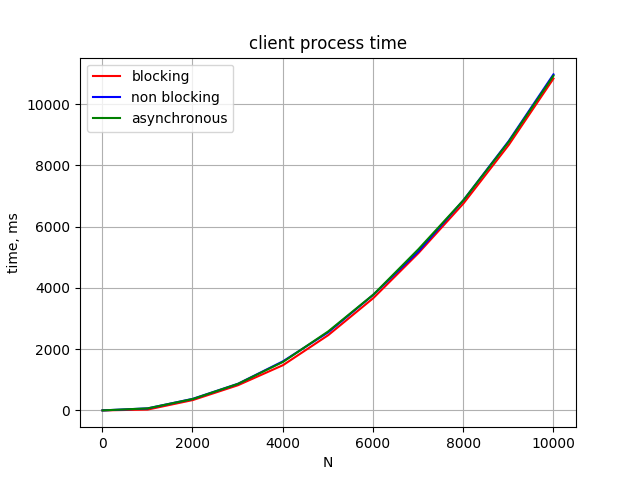
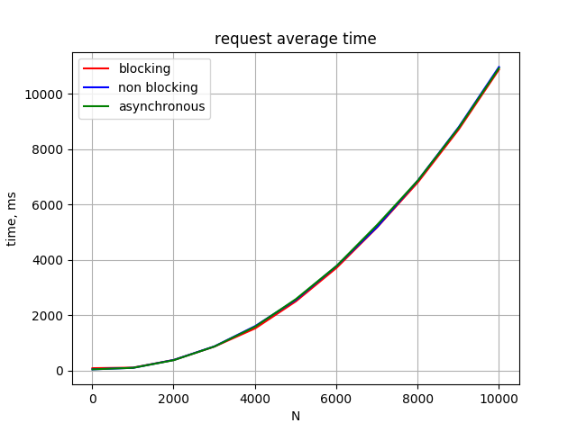
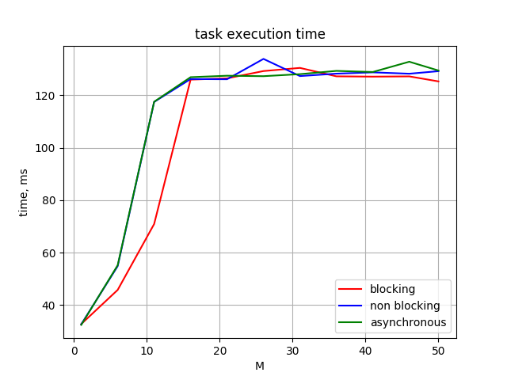
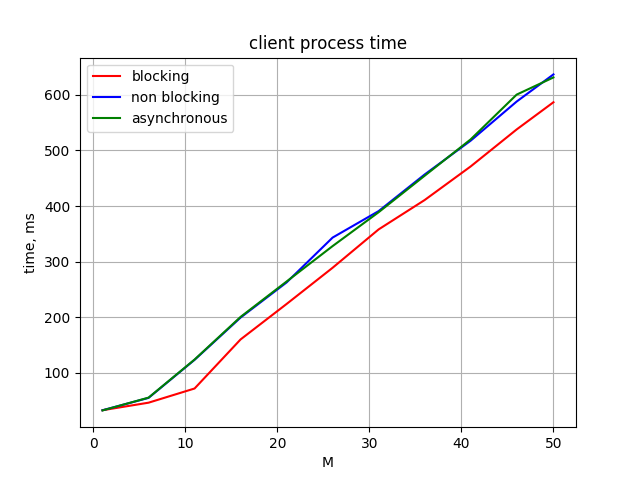
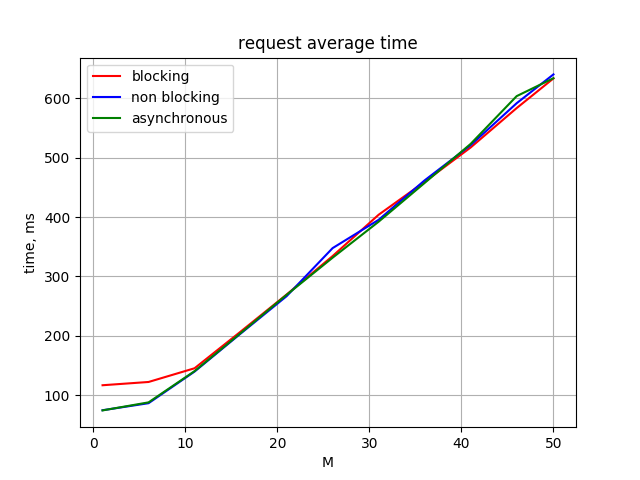
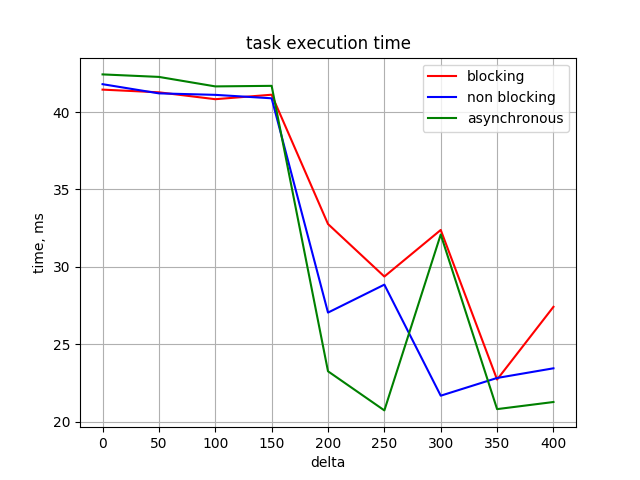
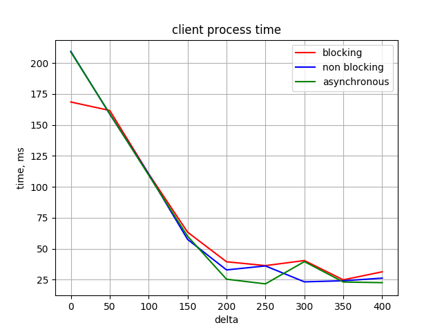
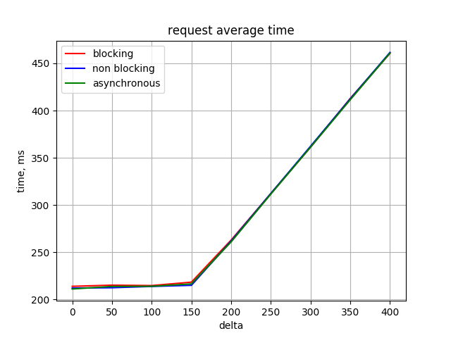

# Server architectures testing application

## How to execute

``./run_application.sh``

## Results

### Various array size (N)

### Various clients count (M)

### Various time delta between requests (delta)

