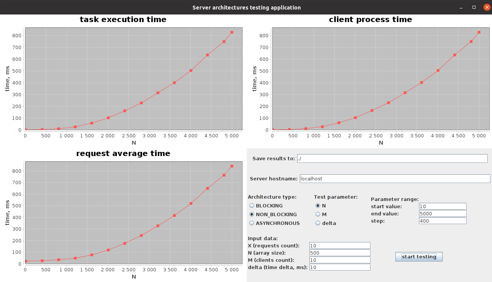
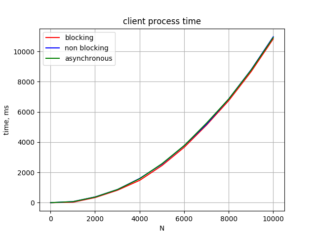
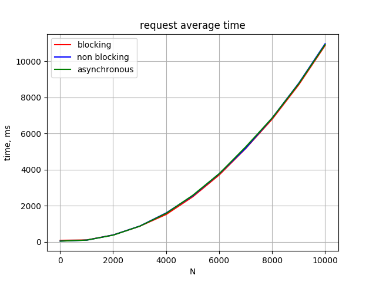
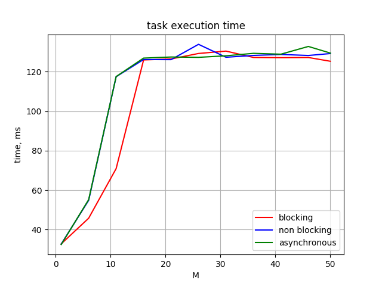
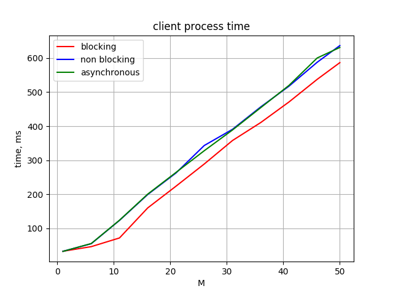
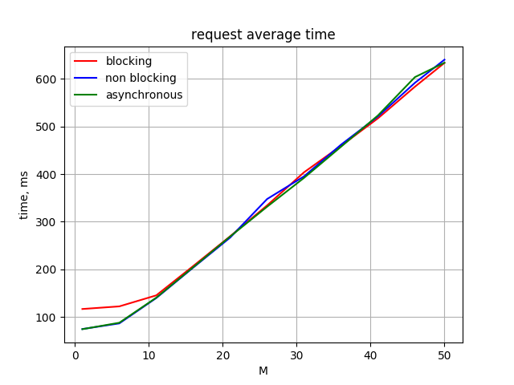
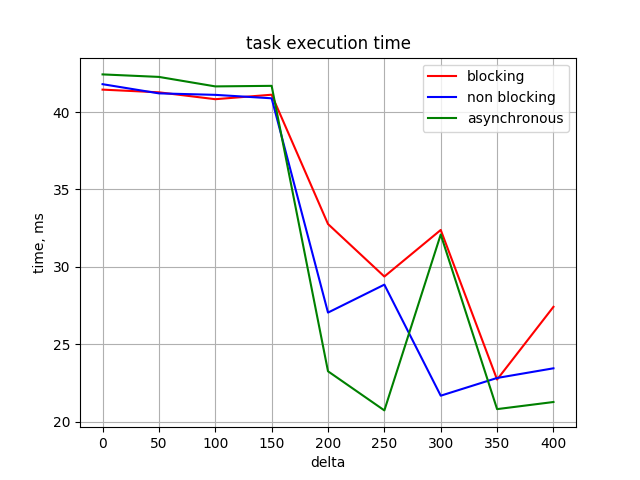
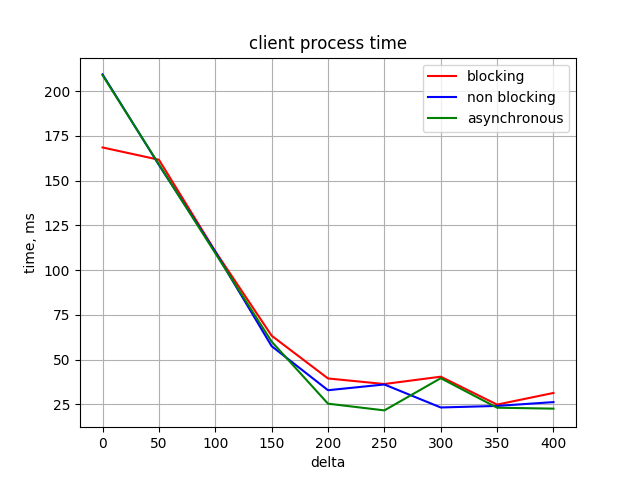
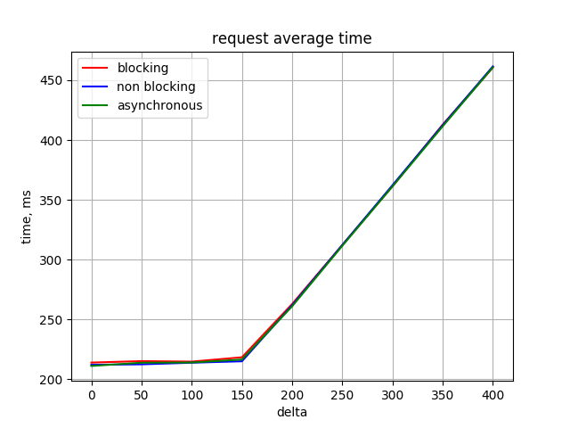

# Server architectures testing application

This application allows you to test different server architectures for different parameters such as clients count, task size, requests count, time between requests.

It measures the following characteristics:

`task execution time` - sort time on the server

`client process time` - time between receive request from a client and send response him

`request average time` - average time between send request and receive response from the server + time delta

## How to execute

`./run_application.sh`

## Example

## Results

### Various array size (N)

`data: ./results/N`

### Various clients count (M)

`data: ./results/M`

### Various time delta between requests (delta)

`data: ./results/delta`

